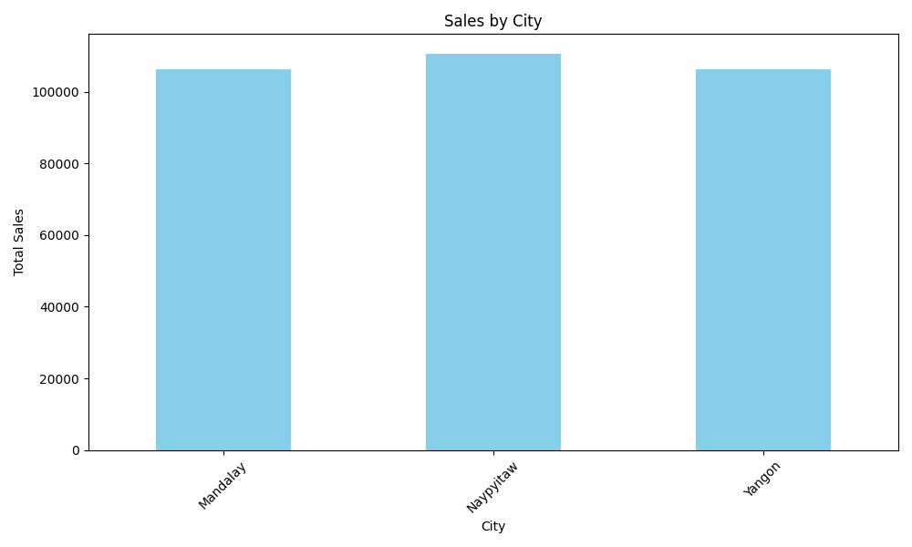
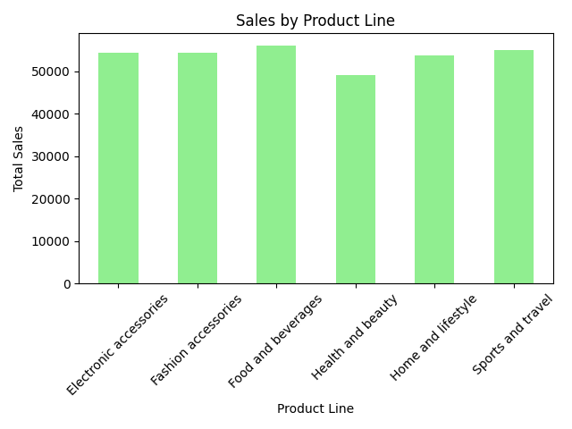
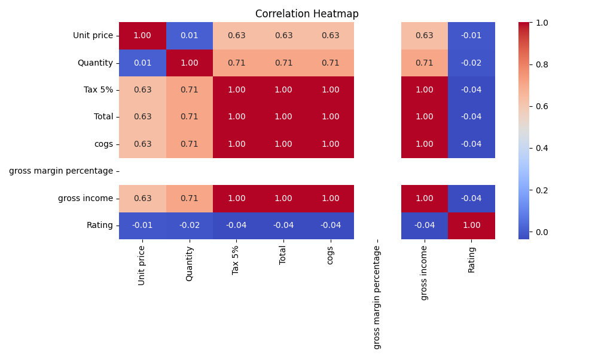
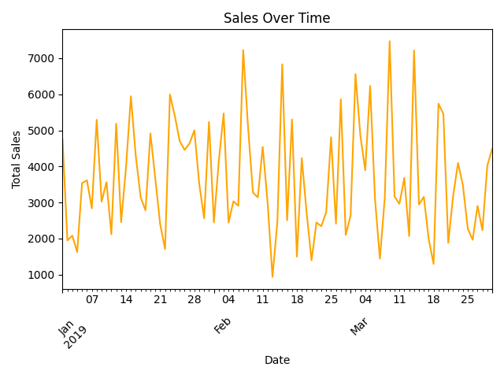
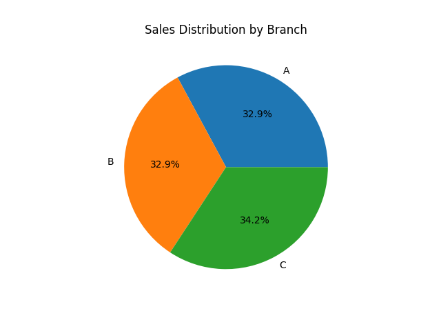
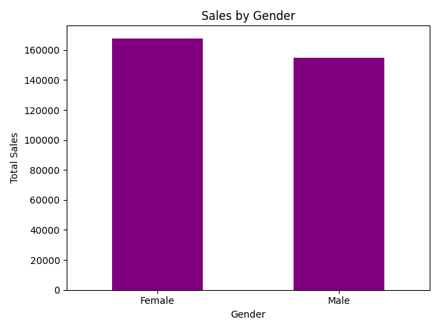
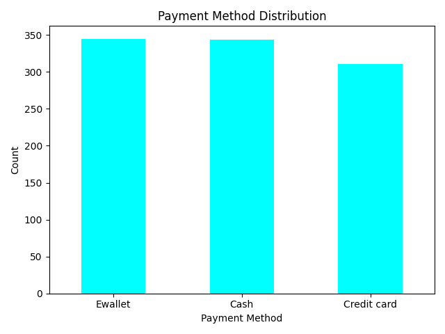
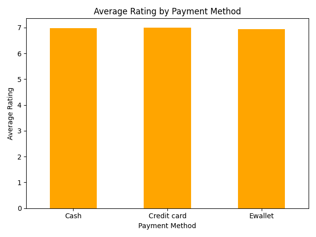
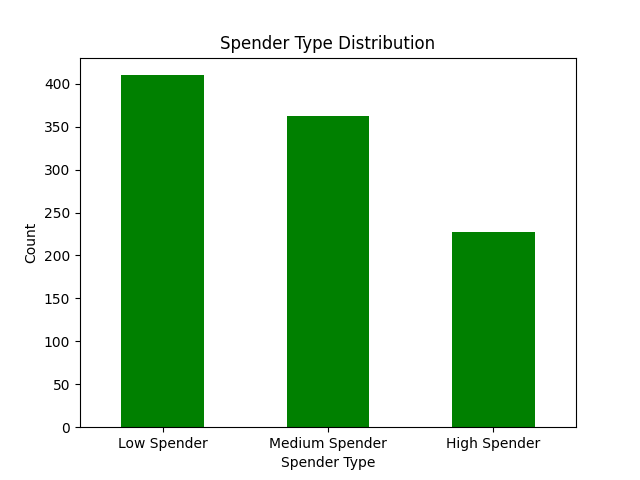
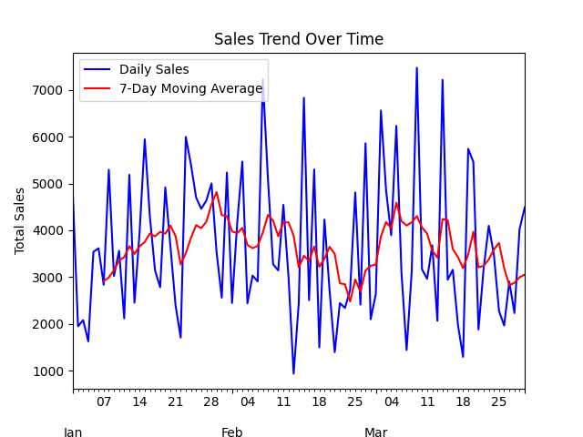

# Sales Analysis for a Retail Store

This repository contains a comprehensive analysis of retail sales data for a Retail Store. The project includes data cleaning, exploratory data analysis, and predictive modeling.

## Features
- **Data Cleaning:** Handling missing values, duplicates, and type conversions.
- **EDA Visualizations:** Sales by city, product line, gender, and more.
- **Predictive Modeling:** Linear regression to predict sales.
- **Sales Insights:** Key insights from the data analysis, including the top product lines, regions with the highest sales, and customer ratings.
    
## Visualizations
Here are some of the visualizations included in the project:
- **Sales by City:**
  
- **Sales by Product Line:**
  
- **Correlation Heatmap:**
  
- **Sales Over Time:**
  
- **Sales by Branch:**
  
- **Sales by Gender:**
  
- **Count of Payment Methods:**
  
- **Average Rating by Payment Method:**
  
- **Visualize Spending Categories:**
  
- **Plot Daily Sales with Moving Average:**
  

## Key Insights
- 'Food and Beverages' was the top product line.
- Sales were highest in the 'Yangon' region.
- Average customer rating was 6.97.

## Tools Used
- **Programming:** Python
- **Libraries:** Pandas, Matplotlib, Seaborn
- **Development Environment:** Visual Studio Code

## Usage
1. Clone the repository:
   ```bash
   git clone https://github.com/SkSankeeth/sales-analysis.git

2. Run the Python script to analyze the data.

## License
This project is open-source under the MIT License.
